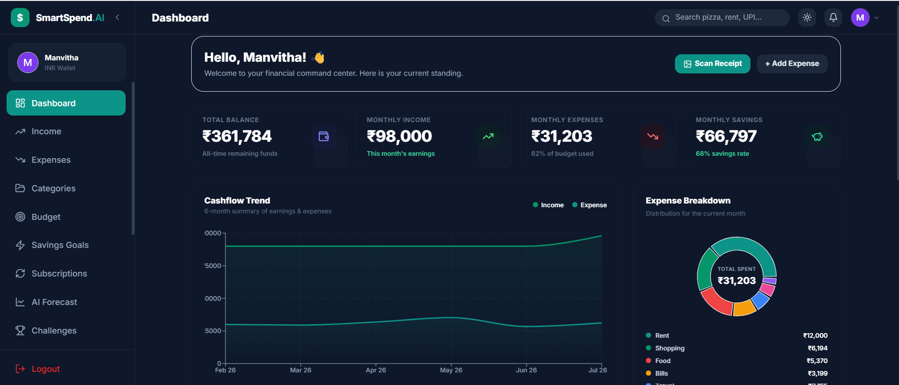
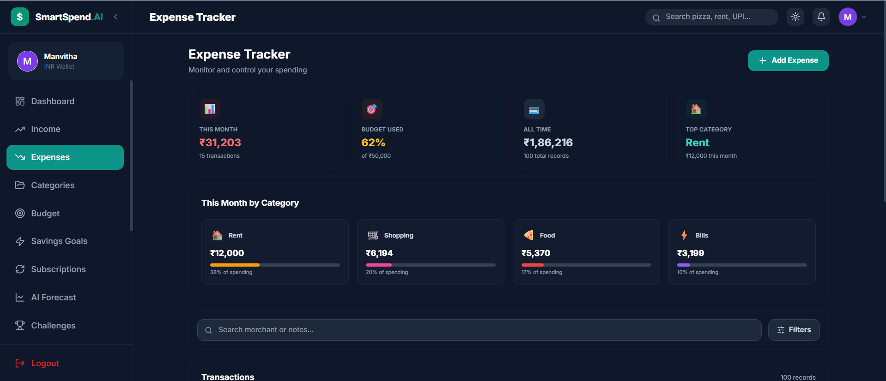
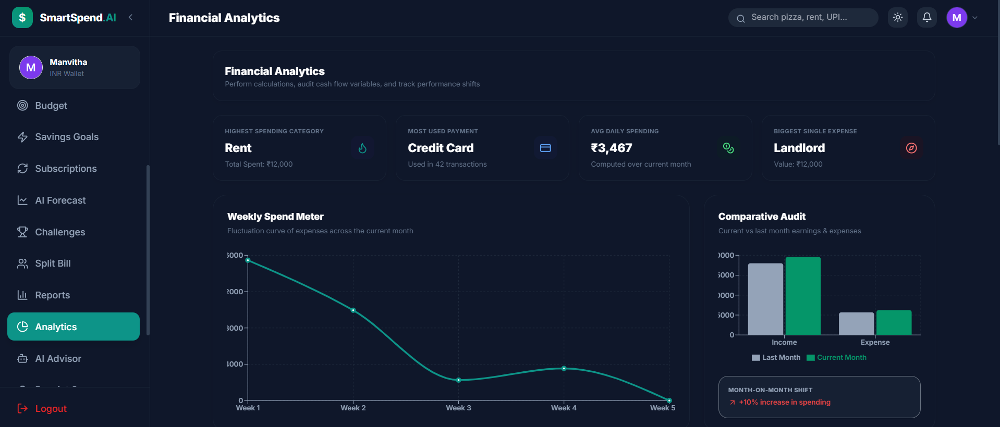
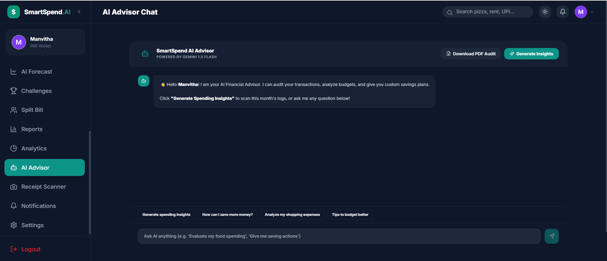
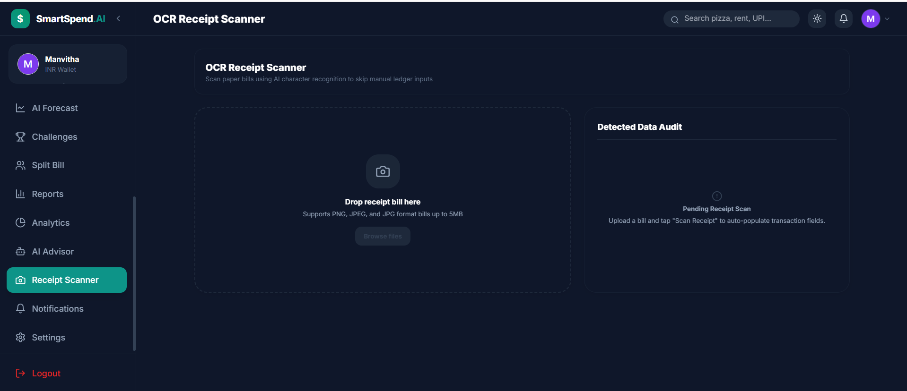
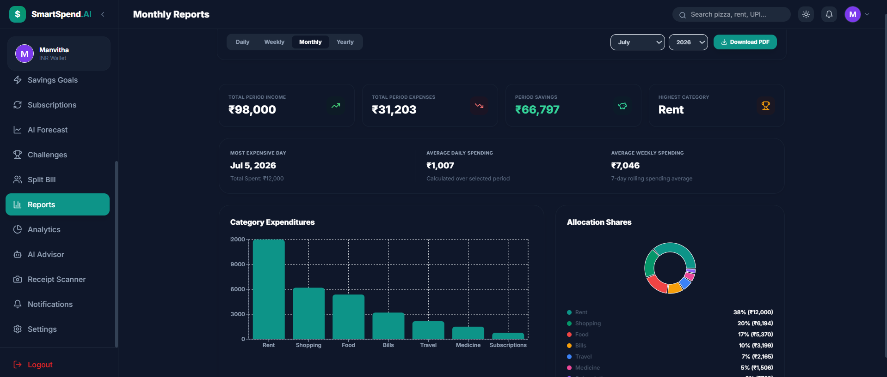
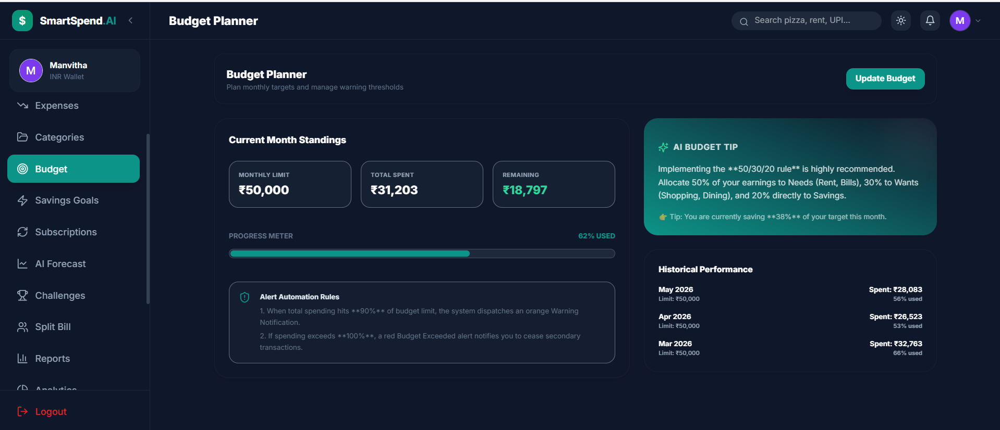

# 💰 Smart Expense Tracker with AI

A modern **AI-enhanced Full Stack Expense Management System** that helps users efficiently manage their personal finances through expense tracking, budgeting, financial analytics, and AI-powered insights. The application combines a responsive React frontend, a secure Express.js backend, MongoDB database, and Google Gemini AI to provide intelligent financial recommendations.

---

## 🚀 Live Demo

- **Frontend:** https://smart-expense-tracker-ai-gamma.vercel.app/
- **Backend API:** https://dashboard.render.com/web/srv-d92adf4m0tmc73dqom90

---

# 📌 Features

### 👤 User Authentication
- Secure User Registration & Login
- JWT Authentication
- Protected Routes
- Session Management

### 💰 Expense Management
- Add Expenses
- Edit Expenses
- Delete Expenses
- Expense Categorization

### 💵 Income Management
- Add Income
- Track Income Sources
- Income History

### 📊 Dashboard
- Financial Summary
- Monthly Income
- Monthly Expenses
- Current Balance
- Recent Transactions

### 📈 Analytics
- Expense Distribution
- Monthly Spending Trends
- Category-wise Analysis
- Financial Statistics

### 🎯 Budget Management
- Create Budgets
- Track Budget Usage
- Budget Progress

### 🏆 Financial Goals
- Create Savings Goals
- Track Goal Progress
- Goal Completion Status

### 📄 Reports
- Monthly Reports
- Expense Summary
- PDF Report Generation

### 🤖 AI Features
- AI Financial Advisor
- Personalized Financial Suggestions
- Smart Spending Recommendations
- Expense Forecasting

### 📷 OCR Receipt Scanner
- Upload Receipt Images
- Automatic Text Extraction
- Easy Expense Entry

### 🔔 Notifications
- Financial Alerts
- Budget Notifications

### 💳 Subscription Tracker
- Manage Monthly Subscriptions
- Track Recurring Payments

---

# 🛠️ Tech Stack

| Category | Technologies |
|-----------|--------------|
| Frontend | React.js, Vite, Tailwind CSS |
| Backend | Node.js, Express.js |
| Database | MongoDB |
| Authentication | JWT |
| AI | Google Gemini API |
| OCR | Tesseract.js |
| Charts | Recharts |
| PDF Export | jsPDF, html2canvas |
| Deployment | Vercel, Render |

---

# 🏗️ System Architecture

```
                  React Frontend
                        │
                        ▼
                Express REST API
                        │
        ┌───────────────┼───────────────┐
        ▼               ▼               ▼
 Authentication     MongoDB        Gemini AI
     (JWT)         Database       Financial Advisor
                        │
                        ▼
                  OCR Receipt Scanner
```

---

# 📂 Project Structure

```
Smart-Expense-Tracker
│
├── frontend
│   ├── src
│   │   ├── components
│   │   ├── pages
│   │   ├── context
│   │   └── assets
│   ├── package.json
│   └── vite.config.js
│
├── backend
│   ├── config
│   ├── controllers
│   ├── middleware
│   ├── routes
│   ├── scripts
│   ├── data
│   ├── server.js
│   └── package.json
│
└── README.md
```

---

# 📸 Application Screenshots

## 🏠 Dashboard



---

## 💰 Expense Management



---

## 📊 Analytics Dashboard



---

## 🤖 AI Financial Advisor



---

## 📷 OCR Receipt Scanner



---

## 📄 Reports



---

## 🎯 Budget Management



---

# 🤖 AI Features

## 💡 AI Financial Advisor

Uses **Google Gemini AI** to provide:

- Personalized financial recommendations
- Smart budgeting suggestions
- Spending pattern analysis
- Savings recommendations
- Financial health insights

---

## 📷 OCR Receipt Scanner

Using **Tesseract OCR**, users can:

- Upload receipt images
- Extract receipt text
- Automatically create expenses

---

## 📈 Financial Forecast

The application analyzes spending history and provides AI-generated financial insights to help users make informed budgeting decisions.

---

# 🔑 Environment Variables

### Backend (.env)

```env
PORT=5000

MONGODB_URI=your_mongodb_connection

JWT_SECRET=your_secret_key

GEMINI_API_KEY=your_gemini_api_key
```

### Frontend (.env)

```env
VITE_API_URL=http://localhost:5000
```

---

# ⚙️ Installation

## Clone Repository

```bash
git clone https://github.com/manvitha40/Smart-Expense-Tracker.git
```

---

## Install Backend Dependencies

```bash
cd backend
npm install
```

---

## Install Frontend Dependencies

```bash
cd ../frontend
npm install
```

---

## Start Backend

```bash
cd backend
npm run dev
```

---

## Start Frontend

```bash
cd frontend
npm run dev
```

---

# 🌐 API Endpoints

## Authentication

```
POST /api/auth/register

POST /api/auth/login
```

## Dashboard

```
GET /api/dashboard
```

## Expenses

```
GET /api/expenses

POST /api/expenses

PUT /api/expenses/:id

DELETE /api/expenses/:id
```

## Income

```
GET /api/income

POST /api/income
```

## Budget

```
GET /api/budget

POST /api/budget
```

## Goals

```
GET /api/goals

POST /api/goals
```

## Reports

```
GET /api/reports
```

## AI

```
POST /api/ai
```

---

# 🚀 Deployment

| Service | Platform |
|----------|----------|
| Frontend | Vercel |
| Backend | Render |
| Database | MongoDB Atlas |

---

# 🔮 Future Enhancements

- 📧 Email Notifications
- 🔁 Recurring Expenses
- 📥 Bank Statement CSV Import
- 📱 Improved Mobile Responsiveness
- 🌙 Dark Mode
- 📊 Advanced Financial Analytics
- 🧠 Machine Learning-based Expense Forecasting
- 👨‍💼 Admin Dashboard

---

# 👩‍💻 Author

**Sai Manvitha Pamulapati**

- GitHub: https://github.com/manvitha40

---

## ⭐ If you found this project useful, consider giving it a star!
